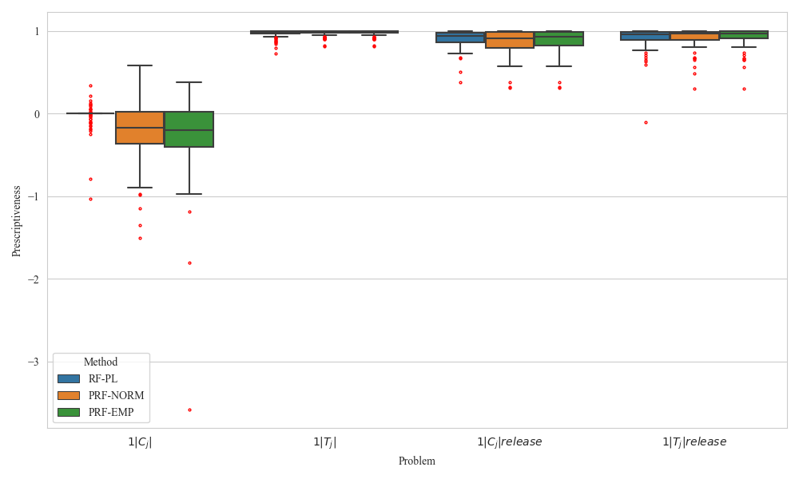
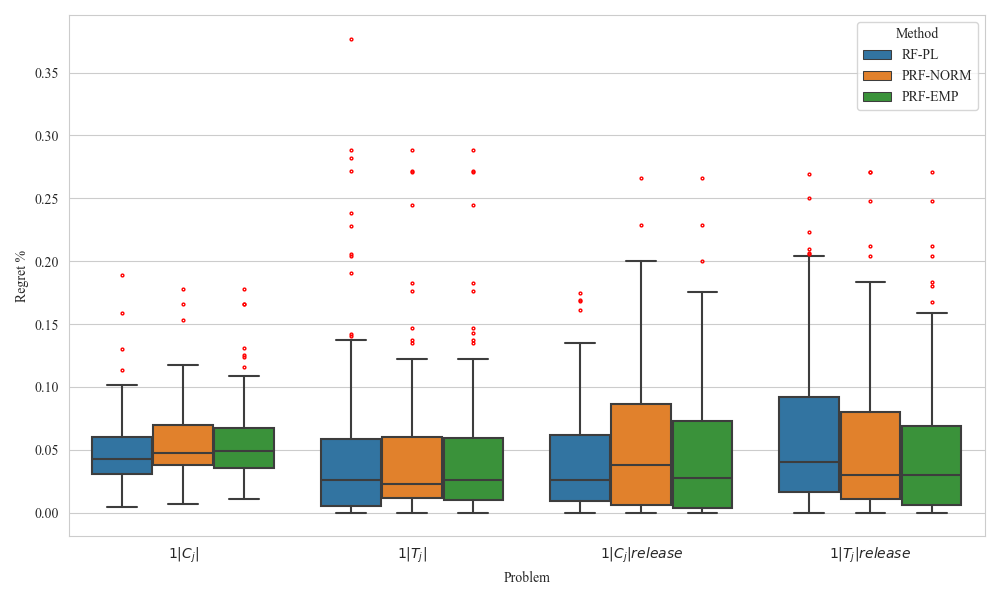
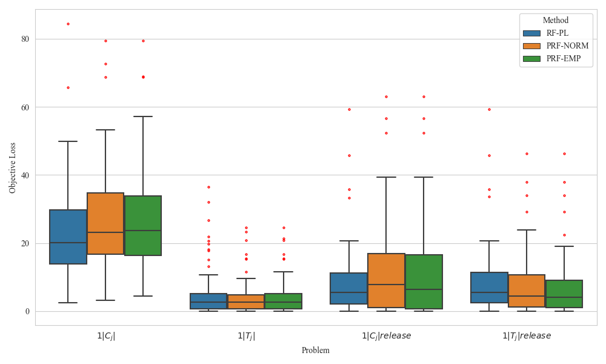

>📋  A template README.md for code accompanying a Machine Learning paper

# My Paper Title

This repository is the official implementation of [My Paper Title](https://arxiv.org/abs/2030.12345). 

>📋  Optional: include a graphic explaining your approach/main result, a BibTeX entry, link to demos, blog posts and tutorials

todo: we haven't updated the paper to Arxiv yet, but we will update the link later

## Requirements

To install requirements:

```setup
pip install -r requirements.txt
```

📋  A licensed gurobi solver installation is required for both data preparation and training. For an educational license see: https://www.gurobi.com/academia/academic-program-and-licenses/

A quick way for environment building is by Anaconda + gurobipy. 

For ploting the figures, packages include venn and seaborn are required.

## Training and Evaluation

We run the experiments by main_nips.py file and config files in nips_config folder.
>📋  The experiments can be reproduced by importing different config file: e.g., import .nips_configs.synthetic.cj_release, will run the experiment synthetic data

>📋  The evaluation is by regret %, optimisation loss and coefficient of prescriptiveness, which will be automatically calculated by example_fig.jpynb file.

```Comparison to SPO trained RF model in Section 5.2
modify this line in main_nips.py: from nips_configs.exp_runtime.cj import *
and run for 1||c_j experiment
modify this line in main_nips.py: from nips_configs.exp_runtime.tj import *
and run for 1||t_j experiment
```

```Release0time-constrained problems in Section 5.2
modify this line in main_nips.py: from nips_configs.synthetic.cj_release import *
and run for 1|r_j|c_j experiment
modify this line in main_nips.py: from nips_configs.synthetic.tj_release import *
and run for 1|r_j|t_j experiment
```
```Real data experiment in Section 5.3
We provided the code for sampling data, exp running and evaluation in this repo.
The data will be released after we uncharaterised it.
```


## Results

We evaluate our algorithm in a laptop with AMD Ryzen 6800HS processor and 24 gigs of rams. 
Since the gurobipy.model could not be pickled, we only use single core to train the prescriptive tree.
We use the decision tree code structure from SPO-T paper to code our method.
However, this stucture is not memory efficient, we plan to update it recently.


### Comparison to SPO trained RF model

Since SPO loss requires repeatly calculating the optimisation loss, we can not use it to very hard combinarional optimisation problems.
Instead, we test two instances: 1. 1||c_j, (polynomial-solvable); 1||t_j (psuedo-polynomial by dynamic programming)


### Release0time-constrained problems


### Real data experiment
Extra results:
1. coefficient of prescriptiveness:


2. regret %:


3. optimisation loss:



## Contributing

>📋  Pick a licence and describe how to contribute to your code repository. 
